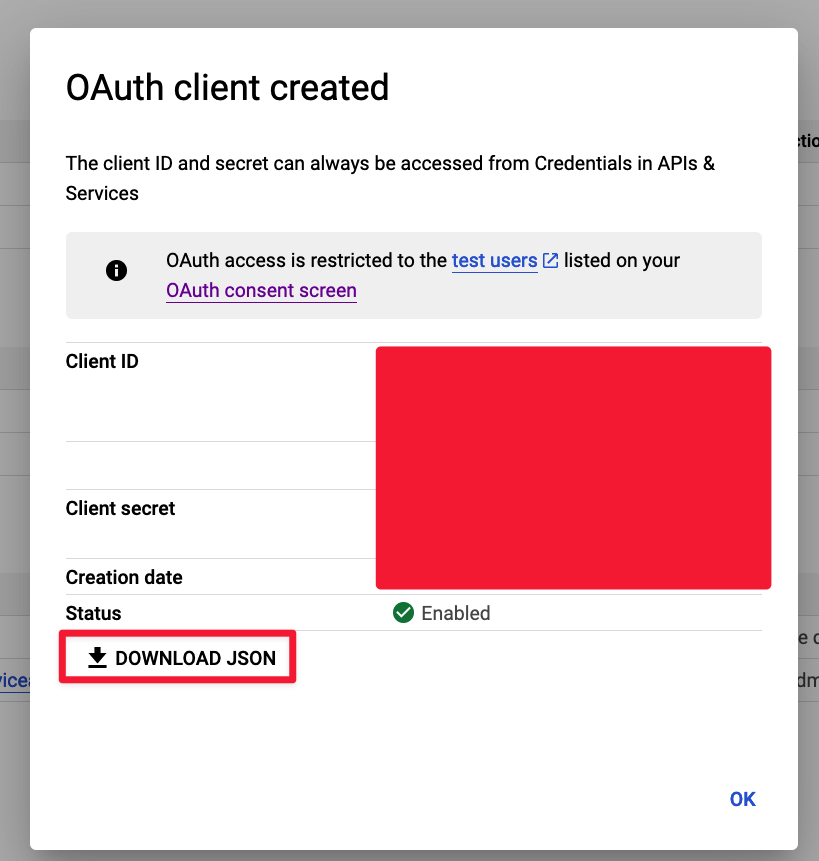
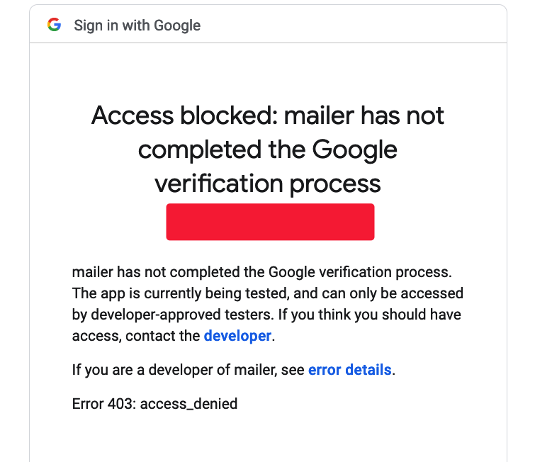
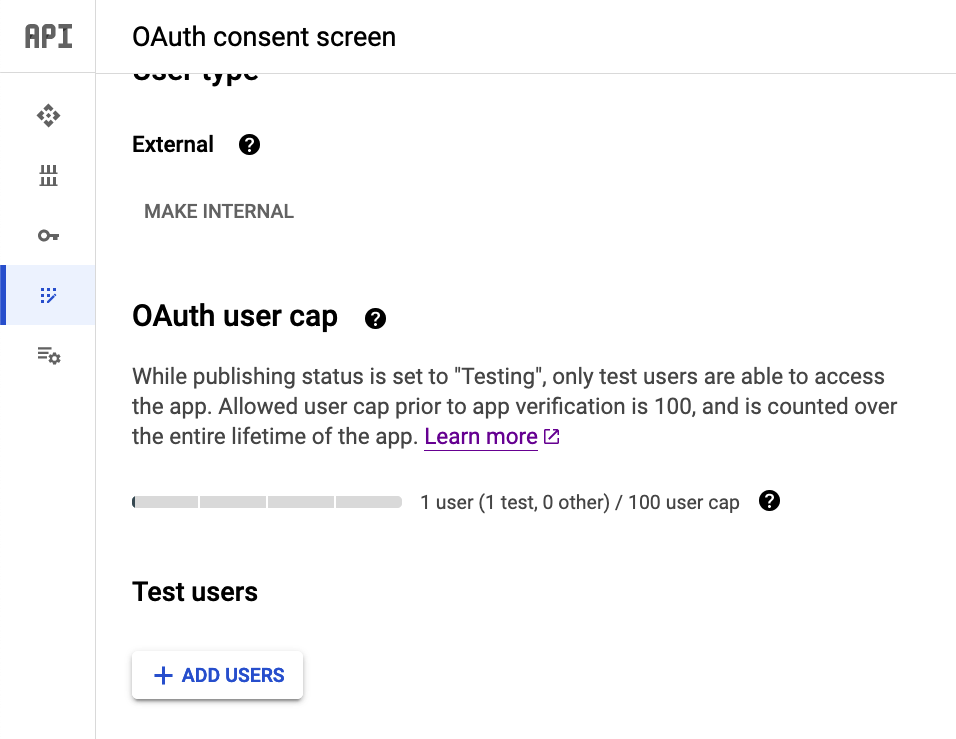

This is for accessing your emails on an individual basis. I will look into updating this to support more than test users at some point.

Get Gmail credentials here: https://console.developers.google.com/apis/dashboard

Download your credential file and save it as `credentials.json`:

## Handling access blocked errors

This can occur if your account has higher security settings:

If you are getting an error when authenticating you should add a test user with your email address on the credentials page:

